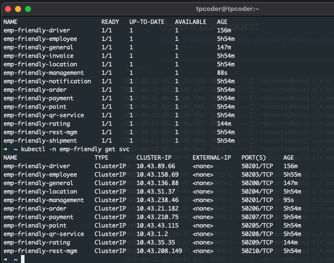
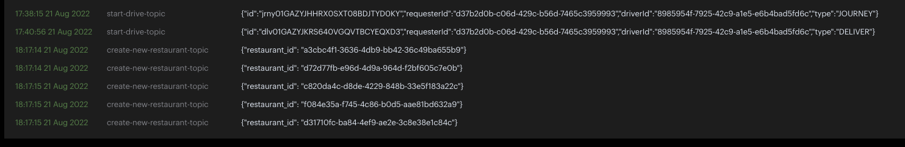
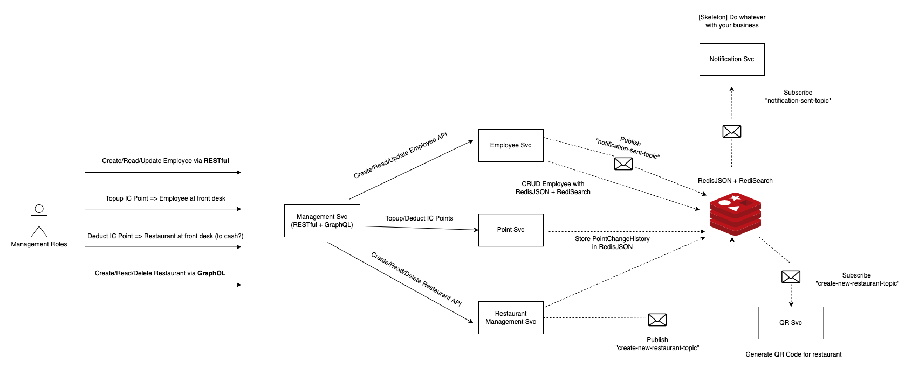
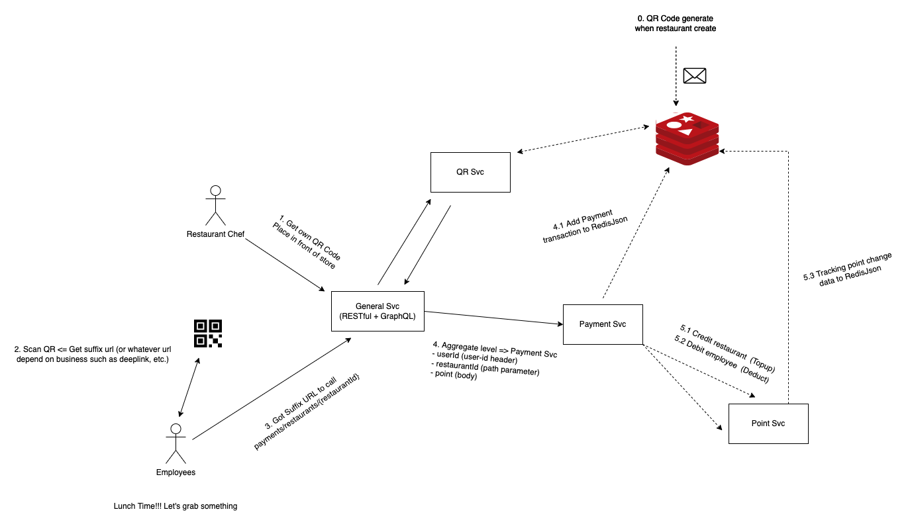
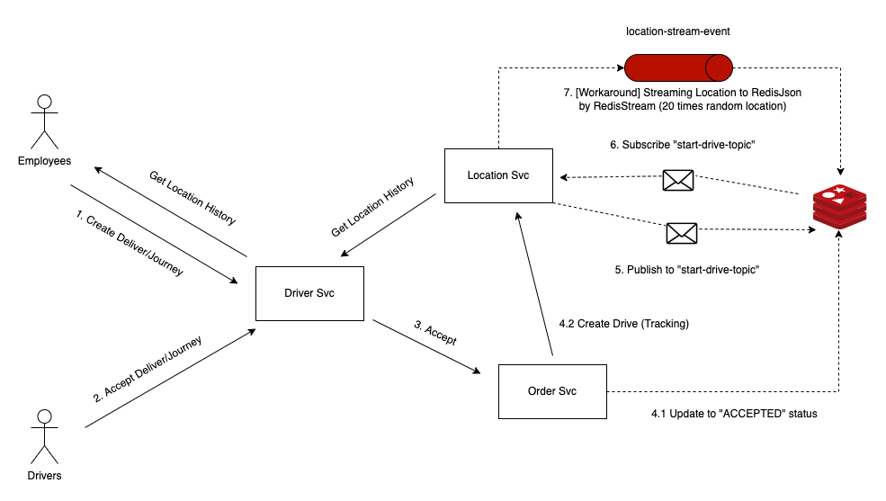

# EmpFriendly

EmpFriendly [Redis Hackathon on DEV 2022] - Support your employees and strive to be better

This project will show the overview of microservices architecture that design base on Cloud-Native approach (actually, some parts still missing because need to compete with the times), In this regards, I design to show how we can implement it from scratch including RESTful/GraphQL API, Aggregation Pattern, Asynchronous messaging with Pub/Sub and Streams.

### Postman Example


### Kubernetes deployment



### Location Streaming screenshots


### Streaming Example in Redisinsights



# Overview video

Here's a short video that explains the project and how it uses Redis:

[](https://youtu.be/ML5Vc8LkZwg)

# Demo/Walkthrough video

Here's a video that shows how api work and explain implementation in some technical:

[](https://youtu.be/B-5_xpC3D8A)

## How it works

### How Architecture look like?


[More Informations](https://github.com/marttp/emp-friendly/tree/main/architecture) are inside the architecture directory

### Scenario 1 - Admin level (who can manage on this role) manipulate data



### Scenario 2 - Pay IC Points



### Scenario 3 - Give rating to restaurant/driver


### Scenario 4 - Driver accepted Deliver/Journey => Start collect location of drivers



### How the data is stored:

Use Redis OM Spring and Redis OM Python as base libraries to work on
Below is JSON format of each document related

#### Employee

```json
{
  "id": "d37b2d0b-c06d-429c-b56d-7465c3959993",
  "firstName": "Thanaphoom",
  "lastName": "Babparn",
  "age": 25,
  "email": "thanaphoom.babparn@empfriendly.dev",
  "addressLoc": "100.7433723,14.0364895",
  "address": {
    "houseNumber": "109/1070",
    "city": "Thanyaburi",
    "state": "Pathum Thani",
    "postalCode": "12110",
    "country": "Thailand"
  },
  "tags": [
    "SOFTWARE_ENGINEER",
    "DEVOPS",
    "CLOUD_ENGINEER",
    "BACKEND_DEVELOPER"
  ],
  "type": "ORDINARY",
  "createdDate": 1660784666190
}
```

#### JourneyOrder

```json
{
  "id": "jrny01GAZY3KGMG8RRACYD81EH4EPK",
  "status": "WAITING",
  "requesterId": "d37b2d0b-c06d-429c-b56d-7465c3959993",
  "driverId": "8985954f-7925-42c9-a1e5-e6b4bad5fd6c",
  "createdDate": 1661076623113
}
```

#### DeliverOrder

```json
{
  "id": "jrny01GAZY3KGMG8RRACYD81EH4EPK",
  "status": "WAITING",
  "requesterId": "d37b2d0b-c06d-429c-b56d-7465c3959993",
  "driverId": "8985954f-7925-42c9-a1e5-e6b4bad5fd6c",
  "createdDate": 1661076623113
}
```

#### OrderStatusTracking

```json
{
  "id": "01GAZY48D16FQ1ZKZJKQRKN4E7",
  "orderType": "DELIVER",
  "status": "WAITING",
  "orderId": "dlv01GAZY4898A4M205Q0QWBVR9YS",
  "employeeId": "d37b2d0b-c06d-429c-b56d-7465c3959993",
  "createdDate": 1661076644324
}
{
  "id": "01GAZYVBDWTTBBJBHE2G1A003A",
  "orderType": "JOURNEY",
  "orderId": "jrny01GAZYJHHRX0SXT08BDJTYD0KY",
  "employeeId": "8985954f-7925-42c9-a1e5-e6b4bad5fd6c",
  "status": "ACCEPTED",
  "createdDate": "2022-08-21T17:23:21.087"
}
```

#### Location

```json
{
  "id": "01GAZZWNPFBY97HMNK5KM7G8HH",
  "referenceId": "dlv01GAZYJKRS640VGQVTBCYEQXD3",
  "driverId": "8985954f-7925-42c9-a1e5-e6b4bad5fd6c",
  "timestamp": 1661078492839,
  "geoPoint": "12.645436856205208,69.10387306037327"
}
```

#### Tracking

```json
{
  "id": "dlv01GAZYJKRS640VGQVTBCYEQXD3",
  "requesterId": "d37b2d0b-c06d-429c-b56d-7465c3959993",
  "driverId": "8985954f-7925-42c9-a1e5-e6b4bad5fd6c",
  "type": "DELIVER"
}
```

#### Point

```json
{
  "referenceId":"d37b2d0b-c06d-429c-b56d-7465c3959993",
  "current": 500100,
  "type": "INDIVIDUAL"
}
```

#### Payment

```json
{
  "id": "01GAZDMREPWATKPJTB2N4M1CZ7",
  "from": "d37b2d0b-c06d-429c-b56d-7465c3959993",
  "to": "c820da4c-d8de-4229-848b-33e5f183a22c",
  "point": 120.0,
  "method": "QR_CODE_SCAN",
  "type": "INDIVIDUAL_DEBIT",
  "createdDate": 1661059359334
}
```

#### PointChangeHistory

```json
{
  "id": "01GAZDMSPKNQ9G3TQ298SM3D22",
  "referenceId": "d37b2d0b-c06d-429c-b56d-7465c3959993",
  "point": -120.0,
  "balancePoint": 500220.0,
  "createdDate": 1661059360527
}
```

==== SAME TRANSACTION ====

```json
{
  "id": "01GAZDMSQ1QW6QVX8CRH8FJ4B0",
  "referenceId": "c820da4c-d8de-4229-848b-33e5f183a22c",
  "point": 120.0,
  "balancePoint": 220.0,
  "createdDate": 1661059360580
}
```

#### RatingHistory

```json
{
  "pk": "01GB2WZ8QKQTMRG8422SH59H60",
  "user_id": "d37b2d0b-c06d-429c-b56d-7465c3959993",
  "target_id": "a3cbc4f1-3636-4db9-bb42-36c49ba655b9",
  "type": "RESTAURANT",
  "rate": 4,
  "timestamp": 1661176088890
}
```

#### Restaurant

```json
{
  "pk": "01GAZ0HSPWKWA60J6CMQ11892G",
  "restaurant_id": "a3cbc4f1-3636-4db9-bb42-36c49ba655b9",
  "name": "SHOP-1"
}
```

#### Restaurant QR Code

```json
{
  "pk": "01GAZG9PHX6Q119B8EDXFQRJK5",
  "restaurant_id": "d31710fc-ba84-4ef9-ae2e-3c8e38e1c84c",
  "status": "active"
}
```

### How the data is accessed:

Use Redis OM Spring and Redis OM Python as base libraries to work on

#### Python Example - QR service

Use JsonModel to perform operation

```python
import datetime

from redis_om import (Field, JsonModel)

class QRCode(JsonModel):
    payment_id: str = Field(index=True)
    status: str = Field(index=True)
    created_date: datetime.datetime

class RestaurantQRCode(JsonModel):
    restaurant_id: str = Field(index=True)
    status: str = Field(index=True)
```

#### Java/Kotlin Example - EmployeeRepository

```java
package dev.tpcoder.empfriendly.employee.repository;

import com.redis.om.spring.repository.RedisDocumentRepository;
import dev.tpcoder.empfriendly.employee.model.Employee;
import java.util.Set;
import org.springframework.data.geo.Distance;
import org.springframework.data.geo.Point;
import org.springframework.stereotype.Repository;

@Repository
public interface EmployeeRepository extends RedisDocumentRepository<Employee, String> {

  Iterable<Employee> findByAddressLocNear(Point point, Distance distance);

  Iterable<Employee> findByFirstNameAndLastName(String firstName, String lastName);

  Iterable<Employee> findByAddress_City(String city);

  Iterable<Employee> findByTags(Set<String> skills);

  Iterable<Employee> findByTagsContainingAll(Set<String> skills);

  Iterable<Employee> findByType(String employeeType);

  Iterable<Employee> search(String text);
}
```

## How to run it locally?

### Prerequisites

Including development and deployments

- Java 17 [Option1 - sdkman](https://sdkman.io/jdks) | [Option2 - Microsoft-OpenJDK](https://docs.microsoft.com/th-th/java/openjdk/download)
- [Python 3.10.4](https://www.python.org/downloads/)
- [Docker](https://www.docker.com/products/docker-desktop/)
- Kubernetes Cluster [Option1 - Kind](https://kind.sigs.k8s.io/) | [Option2 - minikube](https://minikube.sigs.k8s.io/docs/start/)
- [kubectl](https://kubernetes.io/docs/tasks/tools/)
- [Redis Cloud](https://redis.info/try-free-dev-to)
- [Postman](https://www.postman.com/)

### Local installation

For deployment purpose only

1. Install Kubernetes Cluster of choices
2. Create Database in [Redis Cloud](https://redis.info/try-free-dev-to)
3. Follow "How to run it locally?" instructions

### Transform Redis Cloud URL to base64

Note: the redis url format will be redis://{USERNAME}:{PASSWORD}@{REDIS_HOST_URL}:{REDIS_PORT}

```bash
echo 'redis://{USERNAME}:{PASSWORD}@{REDIS_HOST_URL}:{REDIS_PORT}' | base64
```

### Replace your REDIS URL in redis-sc.yaml

After you got Base64 txt data, replace it to redis-sc.yaml

```bash
REDIS_OM_URL: <YOUR_REDIS_URL in base64>
to
REDIS_OM_URL: BASE64_RESULT
```

### Add Stream Group in RedisInsight

```bash
XGROUP CREATE location-stream-event location-stream-event $ MKSTREAM
```

### Start Microservices with Kubernetes Cluster

```bash
kubectl create -f ./k8s
cd k8s
kubectl create -f ./microservice

or

kubectl apply -f ./k8s
cd k8s
kubectl apply -f ./microservice
```

### Port Forward Service (Required 3 Terminals)

```bash
kubectl -n emp-friendly port-forward service/emp-friendly-general 9000:50200
kubectl -n emp-friendly port-forward service/emp-friendly-driver 9001:50201
kubectl -n emp-friendly port-forward service/emp-friendly-management 9002:50202
```

### Calling the API with Postman

Import Postman Collection: **RedisHackathonDev2022.postman_collection.json** to your postman (or use cURL)

Including Aggregator Collection - General, Driver, Management related

## Deployment

To make deploys work, you need to create free account on [Redis Cloud](https://redis.info/try-free-dev-to)

---

## Appendix 1 - List of hardcode initialize id

**USER_ID - ORDINARY**

d37b2d0b-c06d-429c-b56d-7465c3959993

ddf5757a-ca21-41f4-b668-836d7755d70d

1636a414-1f16-45b9-8e36-28507c108be9

**USER_ID - DRIVER**

8985954f-7925-42c9-a1e5-e6b4bad5fd6c

1b4a4de9-0eca-4c73-97c6-e1b9df06678e

93e16962-57d0-4a27-b8f4-8db20f29b25a

**RESTAURANT_ID**

a3cbc4f1-3636-4db9-bb42-36c49ba655b9

d72d77fb-e96d-4d9a-964d-f2bf605c7e0b

c820da4c-d8de-4229-848b-33e5f183a22c

f084e35a-f745-4c86-b0d5-aae81bd632a9

d31710fc-ba84-4ef9-ae2e-3c8e38e1c84c